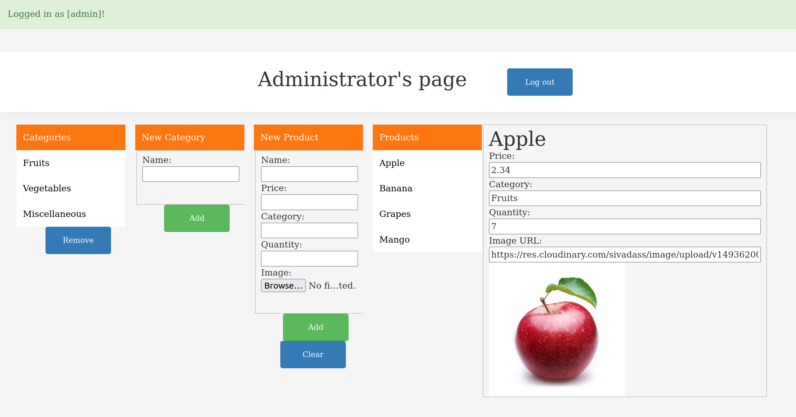
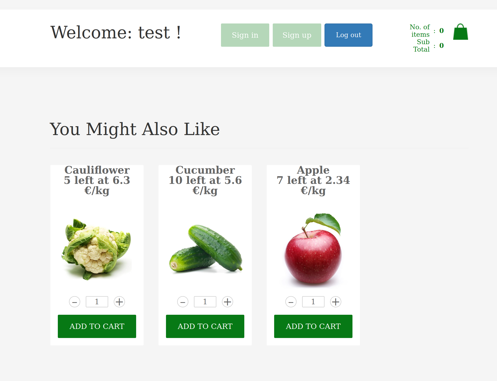
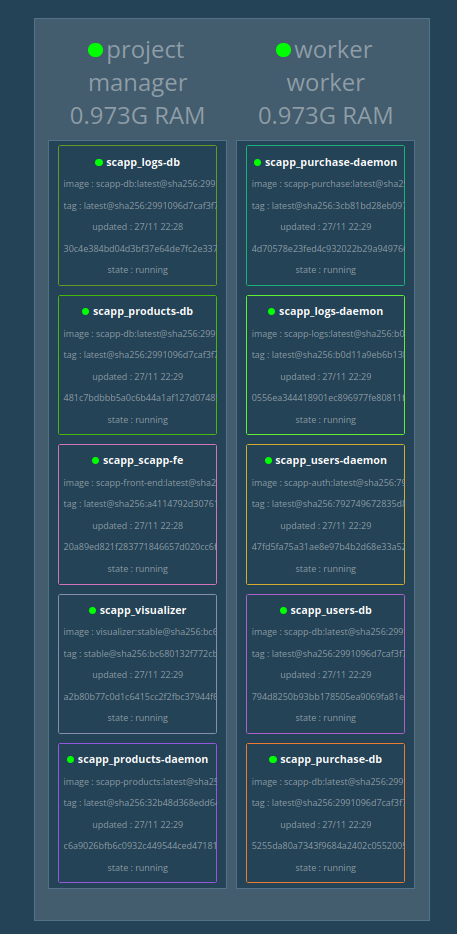
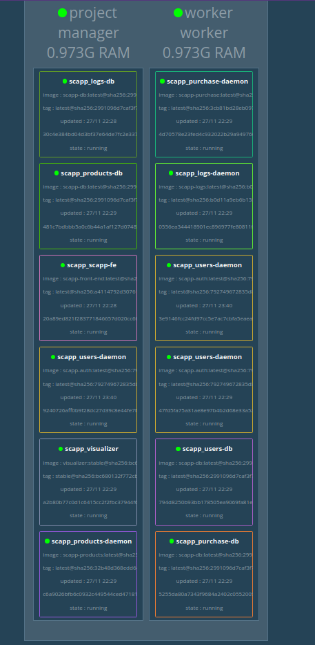

# :books: Project: Scalable Shopping-cart Application

**LINFO2145 December 23, 2022** -- *Merlin Camberlin (09441700), Thomas Bolteau (08692100)*

## Table of contents
1. [Micro-services](#micro-services)
    1. [Front-end service](#front-end-service-srcfront-end)
    2. [Logging service](#logging-service-srcback-endlogging)
    3. [Products Service](#products-service-srcback-endproducts)
    4. [Purchase Service](#purchase-service-srcback-endpurchase)
    5. [Authentication Service](#authentication-service-srcback-endusers)
    6. [Recommendation Service](#recommendation-service-srcback-endrecommendation)
2. [Technology choices](#technology-choices)
3. [Map/Reduce utilisation](#mapreduce-utilisation)
    1. [Map/Reduce utilisation](#mapreduce-utilisation)
    2. [Map/Reduce usage](#mapreduce-usage)
4. [Build containers](#build-containers)
5. [Deployments](#docker-swarm)
    1. [Back-end](#back-end)
    2. [All micro-services on a single VM](#all-micro-services-on-a-single-vm)
    3. [All micro-services on several VM's](#all-micro-services-on-several-vms)
6. [Elasticity scaling](#elasticity-scaling)
    1. [Test elasticity scaling policy](#test-elasticity-scaling-policy)
6. [Azure deployment](#azure-deployment)
    1. [Instructions](#instructions)
    2. [What is deployed?](#what-is-deployed)
    3. [How to delete the infrastructure?](#how-to-delete-the-infrastructure)
7. [Testing](#testing)
    1. [Add more tests](#add-more-tests)
8. [BONUS: Innovative feature](#bonus-innovative-feature)


## Micro-services
This section aims to describe the different micro-services that are implemented in our shopping-cart web store. There are 6 micro-services that are described in the following subsections. Fith of them are back-end micro-services. For each of them, the role of the service and the complete API are given. Each back-end micro-service (except the recommendation engine) employes its own database and offers a *RESTful* *API* over *HTTP*. The associated technologies and the technology choices will be discussed in the [Technology Choices](#technology-choices) section.
 
---
### Front-end Service *(/src/front-end/)*
The front-end micro-service is used as a graphical interface for our shopping cart application. 

#### Administrator interface 
The `admin` user can access the graphical administrator interface while the url `/admin`. The interface is illustrated in the following picture. 


#### Recommendations
There is an integration of the recommendation feature in the front-end. To be visually pleasant the recommendations are displayed on the main screeen of the application once a user is logged in. The recommendation is illustrated in the following picture.


---
### Logging Service *(/src/back-end/logging/)*

This service is used to handle logging. The logging includes performance metric for microservices and user logs. It is also used to get the information for a specific user or the global users product behaviour.

The user logs include the following:
-   ItemViewed
-   ItemAddedToCart
-   ItemRemovedFromCart
-   CartCheckedOut

The performance metrics include the time to respond to a request.

:warning: To use a new type of user log in the recommendation engine, please create a corresponding view in the log database (`logs-db` micro-service) and name it either `global_<eventType>` or `user_<eventType>`. 

#### RestAPI interface endpoints

##### POST /userlog/

Log an user event.

**Parameters**

|        Name | Required | Type        | Localisation | Description                          |
| ----------: | :------: | :---------- | :----------- | ------------------------------------ |
|  `username` | required | string      | BODY         | The user name                        |
| `userEvent` | required | `userEvent` | BODY         | The object describing the user event |

**userEvent**

|                        Name | Required  | Type   | Description           |
| --------------------------: | :-------: | :----- | --------------------- |
|                 `eventType` | required  | string | The type of event     |
|                 `eventTime` | required  | int    | The unix timestamp    |
|                 `eventData` | required  | object | The data of the event |
| `eventData.productViewedId` | optionnal | str    | The product viewed    |
|      `eventData.pageLoaded` | optionnal | str    | The page Loaded       |

**Response**

```
// If success
// 200 code
{
    "status": "Success",
}

// If username undefined
//400 error
{
    "status": "Error",
    "message": "Invalid username"
}

// If user event undefined
//400 error
{
    "status": "Error",
    "message": "Invalid user event"
}

// If failed
//500 error
{
    "status": "Error",
    "message": ...
}
```

##### POST /servicelog/

Log a service event.

**Parameters**

|           Name | Required | Type           | Localisation | Description                             |
| -------------: | :------: | :------------- | :----------- | --------------------------------------- |
|  `serviceName` | required | string         | BODY         | The service name                        |
|   `eventLevel` | required | string         | BODY         | INFO,DEBUG,WARNING,ERROR                |
| `serviceEvent` | required | `serviceEvent` | BODY         | The object describing the service event |

**serviceEvent**

|        Name | Required | Type   | Description           |
| ----------: | :------: | :----- | --------------------- |
| `eventType` | required | string | The type of event     |
| `eventTime` | required | int    | The unix timestamp    |
| `eventData` | required | object | The data of the event |

**Response**

```
// If success
// 200 code
{
    "status": "Success",
}

// If service name undefined
//400 error
{
    "status": "Error",
    "message": "Invalid service name"
}

// If invalid service event
//400 error
{
    "status": "Error",
    "message": "Invalid service event"
}

// If failed

//500 error
{
    "status": "Error",
    "message": ...
}

```

##### GET /servicelog/<serviceName\>

Get the service logs for the specified service.

**Parameters**

|          Name | Required | Type   | Description      |
| ------------: | :------: | :----- | ---------------- |
| `serviceName` | required | string | The service name |

**Response**

```
// If service found

{
    "status": "success",
    "logs": [
            serviceEvent
            ...
        ]
}

// If service not found

//404 error
{
    "status": 'error'
    "message": "Error: To fetch information of service (${serviceName}). Reason: missing."

}

```

##### GET /globallog/<eventType\>

Get the information for the specified event type related to all user interaction.

Example of event type: ItemViewed, CartCheckedOut

**Parameters**

|        Name | Required | Type   | Description    |
| ----------: | :------: | :----- | -------------- |
| `eventType` | required | string | The event type |

**Response**

```
// If user found

{
    "status": "success",
    "eventType": eventType,
    "aggregatedLogs": {
        "productId": count
    }
}

```

##### GET /userlog/<username\>/<eventType\>

Get the information for the specified event type related to the specified user.


Example of event type: ItemViewed, CartCheckedOut, ItemAddedToCart, ItemRemovedFromCart


**Parameters**

|        Name | Required | Type   | Description    |
| ----------: | :------: | :----- | -------------- |
|  `userName` | required | string | The user name  |
| `eventType` | required | string | The event type |


**Response**

```
// If user found

{
    "status": "success",
    "eventType": eventType,
    "aggregatedLogs": {
        "productId": count
    }
}


```


--- 
### Products Service *(/src/back-end/products/)*

This service is used to handle the products catalog and the available categories. This allows to create, update, delete, get products and categories.

#### RestAPI interface endpoints

##### POST /products/

Create a product

**Parameters**

|       Name | Required  | Type   | Localisation | Description                      |
| ---------: | :-------: | :----- | :----------- | -------------------------------- |
|     `name` | required  | string | BODY         | The product name                 |
|    `price` | required  | number | BODY         | The product price                |
| `category` | optionnal | string | BODY         | The category of the product      |
| `quantity` | optionnal | int    | BODY         | The remaining number of products |
|    `image` | required  | string | BODY         | The image data of the product    |

> Detail about the image structure:
> The string should be as follow:
> `data:image/<png/jpg>;base64,<base64 encoded image data>`

**Response**

```
// If success

{
    "status": "Success",
    "productId": productId,
}

// If error in the POST body format
//400 error
{
    "status": "Error",
}

// If failed

//500 error
{
    "status": "Error",
}

```

##### PUT /products/<productId>

Update an existing product

**Parameters**

|       Name |  Required | Type   | Localisation | Description                      |
| ---------: | --------: | :----- | :----------- | -------------------------------- |
|     `name` | optionnal | string | BODY         | The product name                 |
|    `price` | optionnal | string | BODY         | The product price                |
| `category` | optionnal | string | BODY         | The category of the product      |
| `quantity` | optionnal | int    | BODY         | The number of remaining products |
|    `image` | optionnal | string | BODY         | The image data of the product    |

> Detail about the image structure:
> The string should be as follow:
> `data:image/<png/jpg>;base64,<base64 encoded image data>`

**Response**

```
// If success

{
    "status": "Success",
    "productId": productId,
}

// If error in the PUT body format or product not exist
//400 error
{
    "status": "Error",
}

// If failed

//500 error
{
    "status": "Error",
}

```

##### GET /products/<productId\>

Get the product information related to the specified product.

**Parameters**

|        Name | Required | Type   | Description    |
| ----------: | :------: | :----- | -------------- |
| `productId` | required | string | The product id |

**Response**

```
// If product found

{
    "status": "success",
    "product": {
        "_id": string,
        "_rev": string,
        "name": string,
        "price": number,
        "category": string,
        "quantity": int,
        "image": string
    }
}

// If product not found

//404 error
{
    "status": 'error'
    "message": "To fetch information of product (${productId}). Reason: ${reason}."

}

```

##### POST /products/<productId\>/reduceQuantity

Reduce the available quantity for this product

**Parameters**

|        Name | Required | Type   | Localisation | Description            |
| ----------: | -------: | :----- | :----------- | ---------------------- |
| `productId` | required | string | USI          | The product id         |
|  `quantity` | required | int    | BODY         | The amount to decrease |

**Response**

```
// If success

{
    "status": "success",
    "product": productId
}

// If error in quantity to decrease

//400 error
{
    "status": 'error',
    "message": 'Invalid product quantity decrease. Reason: ${reason}'

}

// If not enough stock

//409 error
{
    "status": 'error',
    "message": "Failed to decrease product with id ${productId}. Error: There is no enough remaining products."
}

// If product not found
// 404 error
{
    "status": 'error',
    "message": "Unable to fetch information of product (${productId})"
}

// If failed

// 500 error
{
    "status": 'error'
}


```

##### GET /products/

Get every product information

**Response**

```
// If success

{
    "status": "success",
    "products": [
            productInfo,
            ...
        ]
}

// If failed

// 500 error
{
    "status": 'error',
    "message": "To fetch information for products. Reason: ${reason}."
}


```

##### DELETE /products/<productId\>

Delete the product information for the specified product.

**Parameters**

|        Name | Required | Type   | Description    |
| ----------: | :------: | :----- | -------------- |
| `productId` | required | string | The product id |

**Response**

```
// If success

{
    "status": "success",
    "productId": productId
}

// If product not found

//404 error
{
    "status": 'error',
    "message": "To fetch information of product (${productId}). Reason: ${reason}."
}

//500 error
{
    "status": 'error'
    "message": "Failed to delete product with id ${productId}. Error: ${reason}."
}

```

##### POST /categories/

Create a new category

**Parameters**

|   Name | Required | Type   | Localisation | Description       |
| -----: | :------: | :----- | :----------- | ----------------- |
| `name` | required | string | BODY         | The category name |

**Response**

```
// If success

{
    "status": "success",
    "categoryId": categoryId,
}

// If error in the post body format
//400 error
{
    "status": "Error",
}

// If failed

//500 error
{
    "status": "Error",
}

```

##### PUT /categories/<categoryId>

Modify the category name of the specified category

**Parameters**

|   Name |  Required | Type   | Localisation | Description       |
| -----: | --------: | :----- | :----------- | ----------------- |
| `name` | optionnal | string | BODY         | The category name |

**Response**

```
// If success

{
    "status": "Success",
    "categoryId": categoryId,
}

// If error in the post body format or category not exist

//404 error
{
    "status": "Error",
}

// If failed

//500 error
{
    "status": "Error",
}

```

##### GET /categories/<categorieId\>

Get the category information of the specified category

**Parameters**

|         Name | Required | Type   | Description     |
| -----------: | :------: | :----- | --------------- |
| `categoryId` | required | string | The category id |

**Response**

```
// If success

{
    "status": "success",
    "category": {
        "name": string,
    }
}

// If category not found

//404 error
{
    "status": 'error'
    "message": "To fetch information of product (${productId}). Reason: ${reason}."

}

```

##### GET /categories/

Get every category information

**Response**

```
// If success

{
    "status": "success",
    "categories": [
            categoryInfo,
            ...
        ]
}

// If failed

//error 500
{
    "status": "error",
    "message": "To fetch information for categories. Reason: ${reason}."
}

```

##### DELETE /categories/<categoryId\>

Delete the category information of the specified category.

**Parameters**

|         Name | Required | Type   | Description     |
| -----------: | :------: | :----- | --------------- |
| `categoryId` | required | string | The category id |

**Response**

```
// If success

{
    "status": "success",
    "categoryId": categoryId
}

// If category not found

//404 error
{
    "status": 'error'
    "message": "To fetch information of category (${categoryId}). Reason: ${reason}."

}

// If failed

//500 error
{
    "status": 'error'
    "message": "Failed to delete category with id ${categoryId}. Error: ${reason}."
}
```


---
### Purchase Service *(/src/back-end/purchase/)*

This service is used to interact with the user's cart and the user's purchases history. It allows to add, remove, update, get the items into the user's cart. It enables to get the user's purchases history and to check out the current cart.

#### RestAPI interface endpoints

##### GET /cart/<username\>

Get the cart for the specified user

**Parameters**

|       Name | Required | Type   | Description   |
| ---------: | :------: | :----- | ------------- |
| `userName` | required | string | The user name |

**Response**

```
// If success

{
    "status": "success",
    "cart": [
        productInfo,
        ...
    ]
}

// If failed

//404 error
{
    "status": 'error'
    "message": "Error: To fetch cart of user (${userName}). Reason: ${reason}."

}

```

##### POST /cart/<username\>

Add the product into username 's cart. If there is no cart for user username, a new one is created.

**Parameters**

|       Name | Required | Type          | Localisation | Description        |
| ---------: | :------: | :------------ | :----------- | ------------------ |
| `userName` | required | string        | URI          | The user name      |
|  `product` | required | `ProductInfo` | BODY         | The product to add |


**Response**

```
// If success

{
    "status": "Success",
}

// If failed

//500 error
{
    "status": "Error",
    "message": "Error: The product cannot be added into ${userName}'s cart. Reason: ${reason}."
}

```

##### PUT /cart/<username\>

Remove one product from the username's cart. If the product does not exist in the cart, nothing happens.

**Parameters**

|       Name | Required | Type          | Description                                 |
| ---------: | :------: | :------------ | ------------------------------------------- |
| `userName` | required | string        | The user name                               |
|  `product` | required | `ProductInfo` | The product information to remove from cart |

**Response**

```
// If success

{
    "status": "Success"
}

// If failed

//500 error
{
    "status": 'Error'
    "message": "Error: To remove product from ${userName}'s cart. Reason: ${reason}."
}

```

##### DELETE /cart/<username\>

Empty the cart of the specified user

**Parameters**

|       Name | Required | Type   | Description   |
| ---------: | :------: | :----- | ------------- |
| `userName` | required | string | The user name |

**Response**

```
// If success

{
    "status": "Success"
}

// If failed

//500 error
{
    "status": 'Error'
    "message": "Error: To empty cart of user (${userName}). Reason: ${reason}."

}

```

##### GET /history/<username\>

Get the purchases history of the specified user

**Parameters**

|       Name | Required | Type   | Description   |
| ---------: | :------: | :----- | ------------- |
| `userName` | required | string | The user name |

**Response**

```
// If success

{
    "status": "Success",
    "history": [
                HistoryInfo,
                ...
                ]
}

// If no purchase found

//404 error
{
    "status": 'error'
    "message": "Error: To fetch purchase history of user (${userName}). Reason: ${reason}."

}

```

##### POST /history/<username\>

Add a purchase into the user's history

**Parameters**

|       Name | Required | Type          | Localisation | Description              |
| ---------: | :------: | :------------ | :----------- | ------------------------ |
| `userName` | required | string        | URI          | The user name            |
|  `history` | required | `HistoryInfo` | BODY         | The purchase information |

**History**
|    Name | Required | Type        | Description                    |
| ------: | :------: | :---------- | ------------------------------ |
|  `date` | required | string      | The date the purchase was made |
| `items` | required | `[Product]` | The products purchase          |
| `total` | required | int         | The total price                |

**Product**

|       Name | Required | Type   | Description            |
| ---------: | :------: | :----- | ---------------------- |
|       `id` | required | string | The product id         |
|    `image` | required | string | The product image      |
|    `price` | required | int    | The product price      |
| `quantity` | required | int    | The number of products |
| `subtotal` | required | int    | The subtotal price     |
| `category` | required | string | The product category   |

**Response**

```
// If success

{
    "status": "Success",
}

// If failed

//500 error
{
    "status": "Error",
    "message": "Error: The purchase cannot be added into ${userName}'s history. Reason: ${reason}."
}

```

##### POST /cart/<username\>/purchase

Purchase the cart of the specified user.
This should contain the authorisation token.

**Parameters**

|       Name | Required | Type   | Localisation | Description   |
| ---------: | :------: | :----- | :----------- | ------------- |
| `userName` | required | string | URI          | The user name |

**Response**

```
// If success

{
    "status": "Success",
    "purchaseInfo": PurchaseInfo
}

// If failed

//500 error
{
    "status": "Error",
    "message": "Error: The cart of ${userName} cannot be purchased. Reason: ${reason}."
}

```


---
### Authentication Service *(/src/back-end/users/)* 

This service is used to provide user account and generate a *JavaScript Web Token* ([JWT](https://jwt.io/introduction)). It includes the creation of a new user and the login of an existing user.

> The returned token contains the expiration moment, the timestamp of the generation and the username information. This can be used as an expiration mechanism.

#### RestAPI interface endpoints

##### GET /user/<username\>/<password\>

Get the token for the user with the given username and password.

**Parameters**

|       Name | Required | Type   | Description       |
| ---------: | :------: | :----- | ----------------- |
| `userName` | required | string | The user name     |
| `password` | required | string | The user password |

**Response**

```
// If credential valid

{
    "status": "success",
    "token": str of the auth token of the user
}

// If user not found or credential invalid

//404 error
{
    "status": 'error'
    "message": "Error: To fetch information of ${userName}. Reason: missing."
"
}

```

##### POST /user/<username\>/<password\>

Create the specified user.

**Parameters**

|       Name | Required | Type   | Localisation | Description      |
| ---------: | :------: | :----- | :----------- | ---------------- |
| `userName` | required | string | BODY         | The new username |
| `password` | required | string | BODY         | The new password |

**Response**

```
// If success

{
    "status": "Success",
    "token": str of the auth token of the user
}

// If failed

//409 error
{
    "status": "Error",
    "message": "Error: In the creation of user (${userName}). Reason: Document update conflict.."
}

```

---
### Recommendation Service *(/src/back-end/recommendation/)*

This service is used to interract with the recommendation engine. It is used to get recommendations for a user.


#### RestAPI interface endpoints

##### GET /recommendation/<username\>

Get the recommendation for the specified user

**Parameters**

|       Name | Required | Type   | Description   |
| ---------: | :------: | :----- | ------------- |
| `userName` | required | string | The user name |

**Response**

```
// If success

{
    "status": "success",
    "products": [
        productId,
        ...
    ]
}

```


## Technology choices
Each micro-service is implemented using [NodeJS](https://nodejs.org/en/) using [Express](https://expressjs.com/) which is a popular framework for NodeJS.

Each back-end micro-service (except the recommendation engine) employs its own database able to scale to a potentially large number of clients. The database is implemented using [*CouchDB*](https://couchdb.apache.org/) which is a *NoSQL* database. This database is chosen because it is easy to use and it is a document database which is a good fit for all micro-services. Compared to other similar *NoSQL* document based database, *CouchDB* has an interactive web interface to view the stored information and eases the debugging.

The product micro-service uploads images using a [data url](https://developer.mozilla.org/fr/docs/Web/HTTP/Basics_of_HTTP/Data_URLs) which is a *base64* encoded string. This allows to automatically store the image in the cloud while abstracting the credentials to the end-user.

The authentication service uses *Javascript Web Token* ([JWT](https://jwt.io/introduction)) because it is a standard and it is easy to use. It is also a good choice for the authentication service because it is stateless and does not require to interact with authentication service to validate the token. This allows to scale the authentication service without any problem. The limitation of this is not having the possibility to revoke a specific token. This can be done by adding a blacklist of token in the authentication service but it is not (yet) implemented in this project.

The logging service use the Map/Reduce feature of *CouchDB* to aggregate the logs. This allows to get the aggregated logs for the users activity to then predict the user recommendations.

## Map/Reduce utilisation

Map reduce framework is used in the logging service to aggregate the logs. This allows to get the aggregated logs for the users activity and then predict the user recommendations. It has been setted up using the *CouchDB* api. 

### Map/Reduce views
The views are defined in the view folder of the logging service. They are then used in the logging service to get the aggregated logs.

#### global_ItemViewed
This view is used to get the number of times an item has been viewed by all users.

##### Map function

```javascript
function(doc) {
    if (doc.eventType == "ItemViewed" && doc.eventData.itemId) {
        emit(doc.eventData.itemId, 1)
    }
}
```

##### Reduce function

```javascript
function(key, values) {
    return sum(values)
}
```

#### global_CartCheckedOut
This view is used to get the number of times an item has been bought by all users.

##### Map function

```javascript
function(doc) {
    if (doc.eventType == "CartCheckedOut" && doc.eventData.items) {
        for (var itemIndex = 0; itemIndex < doc.eventData.items.length; itemIndex++) {
            emit(doc.eventData.items[itemIndex].id, doc.eventData.items[itemIndex].quantity)
        }
    }
}
```

##### Reduce function

```javascript
function(key, values) {
    return sum(values)
}
```

#### user_ItemViewed
This view is used to get the number of times an item has been viewed by a specific user.

##### Map function

```javascript
function(doc) {
    if (doc.eventType == "ItemViewed" && doc.eventData.itemId) {
        var result = [[doc.eventData.itemId, 1]];
        emit(doc.username, result)
    }
}
```

##### Reduce function

```javascript
function(keys, values) {
    return values.reduce(function(a, b) {
        var localAggregate = a
        for (var index = 0; index < b.length; index++) {
            var itemId = b[index][0]
            var count = b[index][1]
            var found = false

            for (var index2 = 0; index2 < localAggregate.length; index2++) {
                if (itemId == localAggregate[index2][0]) {
                    localAggregate[index2][1] = localAggregate[index2][1] + count;
                    found = true
                    break;
                }
            }
            if (!found) {localAggregate.push([itemId, count])}
        }
        return localAggregate;
    })
}
```

#### user_CartCheckedOut
This view is used to get the number of times an item has been bought by a specific user.

##### Map function

```javascript
function(doc) {
    if (doc.eventType == "CartCheckedOut") {

        var result = [];
        for (var itemIndex = 0; itemIndex < doc.eventData.items.length; itemIndex++) {
            result.push([doc.eventData.items[itemIndex].id, doc.eventData.items[itemIndex].quantity])
        }

        emit(doc.username, result)
    }

}
```

##### Reduce function

```javascript
function(keys, values) {
    return values.reduce(function(a, b) {
        var localAggregate = a
        for (var index = 0; index < b.length; index++) {
            var itemId = b[index][0]
            var count = b[index][1]
            var found = false

            for (var index2 = 0; index2 < localAggregate.length; index2++) {
                if (itemId == localAggregate[index2][0]) {
                    localAggregate[index2][1] = localAggregate[index2][1] + count;
                    found = true
                    break;
                }
            }
            if (!found) {localAggregate.push([itemId, count])}
        }
        return localAggregate;
    })
}
```
### Map/Reduce usage
To use the map/reduce views, the following functions are defined in the [logging service](/src/logging-service/index.js):

```javascript
function getUserLog(usrName, eventType) {

    return new Promise((resolve, reject) => {
        userLogs.view("queries", "user_" + eventType, { group: true, key: usrName }, (error, response) => {
            if (response) {
                output = {}
                console.log(`response.rows: ${JSON.stringify(response.rows)}`)

                // In case of user not found in the database
                if (response.rows.length === 0) {
                    resolve(output)
                    return
                }
                response.rows[0].value.forEach(function(doc) {
                    output[doc[0]] = doc[1]
                });
                resolve(output)
            } else {
                reject(new Error(`Cannot fetch global information for event (${eventType}). Reason: ${error.reason}.`))
            }
        })
    })
}
```

```javascript
function getGlobalLog(eventType) {
    return new Promise((resolve, reject) => {
        userLogs.view("queries", "global_" + eventType, { group: true }, (error, response) => {
            if (response) {
                output = {}

                console.log(`response.rows: ${JSON.stringify(response.rows)}`)

                response.rows.forEach(function(doc) {
                    output[doc.key] = doc.value
                });
                resolve(output)
            } else {
                reject(new Error(`Cannot fetch global information for event (${eventType}). Reason: ${error.reason}.`))
            }
        })
    })
}
```

Theses interfaces allow to easily add up some new metric to improve the recommendation engine. To register a new user log type, the following steps are required:
- Add a new map/reduce view
- Call the new metric in the recommendation engine

## Build containers
In order to build all containers automatically, a script is provided. The script [build](src/build) builds all the docker images required for the shopping cart application. The script [build-push.sh](/src/build-push.sh) has the same behavior but it also pushes the built images on the *DockerHub* account specified in the file.


## Deployments

### Back-end
In order to run the back-end automatically, a script is provided. The file [deploy-back-end.sh](src/deploy-back-end.sh) instantiates a swarm with all the back-end micro-services.

:warning: Change `IP_VM` in the [deploy-back-end.sh](src/deploy-back-end.sh) script with the IP address of the VM on which to run the back-end micro-services.

### All micro-services on a single VM 
In order to deploy all the micro-services on a single VM, a script is provided. The file [deploy-local.sh](src/deploy-local.sh) instantiates a swarm with all the micro-services.

:warning: Change `IP_VM` in the [deploy-local.sh](src/deploy-local.sh) script with the IP address of the VM on which to run the micro-services.

:warning: Replace the current IP address set (`192.168.56.102`) in the environment variables in the file [scapp-local.yml](src/scapp-local.yml) (lines 118-122) with the IP address of the VM on which to run the micro-services.

### All micro-services on several VM's
In order to deploy a docker swarm on multiple VM's, here are instructions to follow.

0. (Optional) Execute the script [build-push.sh](/src/build-push.sh) in the src folder. 
    :warning: Replace `DOCKER_ID` with the *DockerHub* id on which to push the images.

1. Instantiate a swarm on a manager VM with the following command: `docker swarm init --advertise-addr IP_OF_VM_LEADER`.
    :warning: Replace `IP_OF_VM_LEADER` with the IP address of the manager VM.

2. To add a manager or a worker to this swarm, follow the instructions given in the output of the previous command.

3. Create a network of containers by running the following command in the manager VM: `docker network create --driver overlay --attachable scapp-net`.

4. - If the VM's are running locally, deploy our shopping cart application by running the following command in the folder /project/src: `docker stack deploy -c scapp-remote.yml scapp`.
        - :warning: Replace the current IP address set (`192.168.56.102`) in the environment variables in the file [scapp-remote.yml](src/scapp-remote.yml) (lines 118-122) with the IP address of the VM manager.
        - :warning: Replace `mcamberlin` in the [scapp-remote.yml](/src/scapp-remote.yml) file with the *DockerHub* id on which the images were pushed on step 0.

    - If the VM's are running on *Azure*, deploy our shopping cart application by running the following command in the folder /project/src: `docker stack deploy -c scapp-azure.yml scapp`
        - :warning: Change environment variables in the file [scapp-azure.yml](src/scapp-azure.yml) (lines 123-127) to match the corresponding URL of the micro-services.
        - :warning: Replace `mcamberlin` in the [scapp-azure.yml](/src/scapp-azure.yml) file with the *DockerHub* id on which the images were pushed in step 0.

## Elasticity scaling

:warning: **Prerequisites**. Make sure to be able to create a SSH connection from the manager VMs to the worker VMs.

The scalability policy is implemented in the file [apply-policy-of-scalability.sh](src/scalability/apply-policy-of-scalability.sh). This policiy triples the number of replicas of a micro-service when its average CPU usage reaches 90% of CPU usage. To apply the policy of scalability:
1. Open a new terminal on the manager VM
2. Execute the following command in the folder [/project/src/scalability](/src/scalability/): 
`./apply-policy-of-scalability.sh scapp SERVICE_NAME`
:warning: Replace `SERVICE_NAME` with the service name to apply the scaling policy. Service names are specified in the [scapp-local.yml](/src/scapp-local.yml) file (e.g. *users-daemon*). 

### Test elasticity scaling policy
To test the elastic scaling policy, traffic must be injected. To do so, an *artillery* docker image is used. Here are the instructions to build and run this container. 
1. Open a new terminal on the manager VM
2. Build the artillery image with executing the following command in the folder [/project/src/scalability/artillery](/src/scalability/artillery/):
`docker build -t artillery .`
3. Run the artillery container and link this container with the network of the stack *scapp* with the following command:
`docker run -d --name artillery --network scapp-net artillery`

As an illustration, here is the scaling of the authentication service. The docker visualizer before running the traffic injection is shown bellow. As illustrated, there is only a single *users-daemon* replicas.   

After injecting traffic into *users-daemon*, the number of *users-daemon* replicas has trippled as expected and as the figure bellow shows.



## Azure deployment

### Instructions
To deploy a cluster of two virtual machines supporting docker in order to run our shopping-cart web store, here are the instructions to follow.

0. (Optional) Build the application using the [build-push.sh](src/build-push.sh) script. 
    >:warning: Replace `DOCKER_ID` with the *DockerHub* id on which to push the images in the [build-push.sh](src/build-push.sh) file before executing it.

    >:warning: Replace `mcamberlin` in the [scapp-azure.yml](src/scapp-azure.yml) file with the *DockerHub* id on which the images were pushed while executing the [build-push.sh](src/build-push.sh) script.

1. (Optional) Create a service account on *Azure Storage*, and create a container. Then, update the environment variables in the service `products-daemon` in the [scapp-azure.yml](src/scapp-azure.yml) file. Otherwise, the service will use the default azure storage account. 
    > :warning: Be careful to allow the public access to the container.
    > In case of customization of the blob, please be careful to update the [scapp-azure.yml](src/scapp-azure.yml) file with the correct environment variables. Also please note that `AZURE_SAS` environment variable should start with `?`

2. Start a new *AzureCLI* session using the command: `az login`

3. Run the script [deploy-azure](src/deploy-azure.sh) to deploy the infrastructure on *Azure*. Customisation of this script is optional. The deployment will take around 10 minutes. After the script is executed please wait a few minutes for the services to be deployed.
    > :warning: In case of failure, this might be caused by a wrong password of a dns not yet propagated. In this case, please copy the command that failed and run it again and end the deployment manualy by copy pasting the commands. It may be necessary to copy the environment variables defined in the script.

    > :warning: The password must be entered multiple times for establishing the ssh connection. The default password is "**Safe0!**". However, parameters can be changed at the start of the script.

    > :warning: If the DNS and github has changed, according changes must be performed in the [scapp-azure.yml](src/scapp-azure.yml) file for the frontend address based on the following schema `http://${MASTER_DNS}-${GITHUB_ACCOUNT}.westeurope.cloudapp.azure.com`.

4. Access the website using the url returned by the script.

### What is deployed ?
The script [deploy-azure.sh](/src/deploy-azure.sh) creates:
-   A resource group named *linfo2145.weu* and located in west-europe,
-   An instance of an Ubuntu VM with docker installed as a swarm manager,
-   Another instance of an Ubuntu VM with docker installed as a swarm worker,
-   A network security group to allow the communication between the swarm manager, the swarm worker and the internet,
-   The binding between the network security groups and the virtual machines,
-   A docker swarm in the manager VM and add the second VM to this swarm.
-   A docker stack named *scapp* using the `docker stack deploy -c scapp-azure.yml scapp` command and the `scapp-azure.yml` file.

### How to delete the infrastructure ?

Please go on you azure dashboard and delete the ressource group named `linfo2145.weu`


## Testing
There is one sub-folder named *tests* in each micro-service folder. To run those tests, here are the instructions:
1. Run the isolated stack using the [deploy-isolated-services.sh](/src/deploy-isolated-services.sh) script
    > This script stop & run all the microservices in an isolated manner using the `BUILD_ENV===test` flag. This allows to prevent micro-services to really communicate but to return default values to prevent side effects. In case of modification of the microservices, the script will rebuild the microservices and restart them (at the next start of the script).
2. Install the following python lib `python3 -m pip install requests pytest`
3. Run the tests using the command `pytest . --ip <ip of the swarm manager>`

### Add more tests

> NB: In multiple micro-services the flag `BUILD_ENV===test` is used to prevent the micro-service to really communicate with other micro-services. This flag is used to prevent side effects. Please use this flag when communication with other microservices is required to making possible to isolate them or to change their behavior in a test environment.
> Please keep up to date the default behavior of theses micro-services when the flag is set.

1. Add a new file in the `tests` folder of the micro-service you want to test
2. Create a file starting with `test_` and ending with `.py`
3. In this file create a function starting with `test_`
4. To make a request to the microservice stack, add the `ip` parameter to the function and use it to make the request as `url = f"http://{ip}:<port of the microservice>/<path of the endpoint>"`


## BONUS: Innovative feature
The project contains an innovative feature that goes beyond what was required. The added feature handles the stocks for each product. In addition to the required information to detail a product, we added a field *quantity* that informs the remaining number of items of such a product. When a command is checked out, this *quantity* field is modified. When there is no enough remaining products for a purchase, the purchase is rejected. In order to have a simultaneous view of the reamining products, the shopping-cart main page automaticaly refreshes the products every 5 seconds to adapt any change in stocks or product information (price, name, category, ...) modification from the admin panel.

